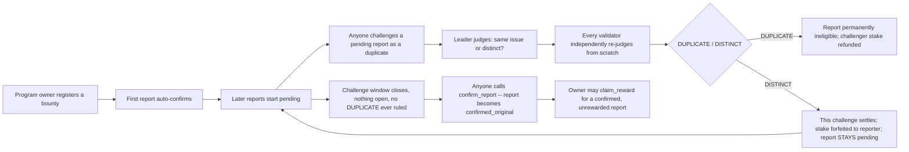

# DisclosurePriorityGate

A reusable GenLayer Intelligent Contract primitive that decides whether a newly submitted disclosure report duplicates an already-confirmed earlier one, or is genuinely distinct -- by comparing the two reports' text directly, through independent validator consensus, never through a program owner's own say-so. Any permissionless bug-bounty, whistleblower-reward, prior-art, or research-priority registry needs exactly this judgment and cannot make it fairly on its own.

## Deployed contract

**Network:** GenLayer Bradbury Testnet

**Contract (1.1.0, current):** `<filled in after redeploy -- see docs/DESIGN.md#live-verification>`

This supersedes 1.0.0 (`0x6688dA9243b0095827d60E528f38e0933f65904a`, deploy tx `0xdc8c3d0b57219675dbb2804b2c6a7a78c32c07681c410328322e0fe368e3cec9`), redeployed after a GenLayer Portal steward's review found a real gap in the challenge lifecycle: a `DISTINCT` verdict against one challenger-selected baseline was incorrectly granting a report permanent immunity from challenges against other confirmed baselines, and an unchallenged report had no path to confirmation at all. Fixed with a new `confirm_report` method and a fixed challenge window -- full finding and fix in [`docs/DESIGN.md`](docs/DESIGN.md#steward-review-first-submission----a-real-gap-in-the-challenge-lifecycle-not-caught-by-this-accounts-own-self-review), CHANGELOG.md.

**A real, live, end-to-end transaction sequence was run on 1.0.0, not just a bare deploy.** `register_program` → `submit_report` (x2, the second a deliberate paraphrase of the first) → `challenge_duplicate` → `evaluate_challenge` all ran as real signed transactions against Bradbury. The genuinely unscripted model call correctly judged the paraphrased second report `DUPLICATE`, with real, specific reasoning: *"Both reports describe the same underlying reentrancy vulnerability in the withdraw function where an external transfer occurs before updating the user's balance state, enabling recursive calls to drain funds."* This record still stands as proof the independent-re-derivation mechanism itself converges correctly -- the `DUPLICATE` branch and `leader_fn`/`validator_fn` are unchanged by the 1.1.0 fix, which only touched the `DISTINCT` branch's status-write logic and added `confirm_report`. Full transaction record: [`docs/DESIGN.md`](docs/DESIGN.md#live-verification).

## The trust problem

Every permissionless disclosure or bounty program has the same unsolved gap: two independent parties may report the *same* underlying issue in different words -- different vocabulary, different level of detail, a different example illustrating the same root cause. Someone has to decide whether the second report is a genuine duplicate or a distinct discovery. If that someone is the program owner, they have a direct financial incentive to call every inconvenient report "duplicate" and dodge a payout -- and no reporter can prove otherwise against a purely unilateral call. A single centralized arbiter (the owner, or any other one party) is exactly the trust bottleneck this primitive removes.

**Not the pattern this category filters out.** This is not a thin LLM wrapper: the judgment is bound to a discrete, Equivalence-Principle-checked bucket (`DUPLICATE`/`DISTINCT`), never a free-form score or prose a caller could construe however suits them. Not a format-only validator: `validator_fn` never inspects the leader's claimed verdict for shape -- it re-runs the identical judgment from scratch over the identical, already-stored report texts, and only agrees if it independently lands on the same bucket. Not a generic "AI decides X" demo: GenLayer's role is narrowly "do these two texts describe the same issue," never "is this report valid, in-scope, or worth a reward" -- those stay the program owner's own calls, made only after GenLayer's narrower question is settled.

## What it does



1. A program owner registers a bounty with `register_program`: a `program_id`, a `scope` description, a `submission_fee`, and a `min_challenge_stake`.
2. Anyone may `submit_report` against a registered program, paying the fee (forwarded straight to the owner). The very first report for a program has nothing to compare against, so it auto-confirms as the priority holder; every later report starts `"pending"` for a fixed challenge window.
3. Anyone -- the owner, a rival reporter, a disinterested third party -- may `challenge_duplicate` a still-`"pending"` report against an already-`"confirmed_original"` baseline, backing the challenge with a GEN stake.
4. `evaluate_challenge` is the one non-deterministic step: the leader reads both reports' title+description and judges whether they describe the same underlying issue, forced into exactly one of two buckets. Every validator independently re-reads both reports and re-runs the identical judgment -- never trusts the leader's claim -- and only agreement counts.
5. A `DUPLICATE` verdict permanently disqualifies the challenged report from ever being rewarded and refunds the challenger's stake. A `DISTINCT` verdict settles only THAT challenge (stake forfeited to the reporter, deterring bad-faith challenges) and leaves the report `"pending"` -- surviving a challenge against one baseline must never grant immunity from a challenge against a different one.
6. Once a report's fixed challenge window has fully elapsed with no challenge currently open and no `DUPLICATE` ever recorded against it, anyone may permissionlessly `confirm_report` it -- the only way a non-first report reaches `confirmed_original`. This also gives a never-challenged report a path to confirmation.
7. Only the program owner may `claim_reward` for a report that is `confirmed_original` and not yet rewarded -- whatever GEN they attach to the call is the reward, paid directly, once.

## Why GenLayer is required

Two independently-written reports describing the same real-world issue will almost never share exact wording -- different vocabulary, different structure, a different example used to illustrate the same root cause. Deciding whether they're "the same issue" is a genuine language-understanding judgment with no formula and no deterministic string-comparison shortcut. A single off-chain reviewer -- especially the program owner, who has a direct financial incentive to call every inconvenient report a duplicate -- is exactly the trust bottleneck a permissionless bounty program needs to remove. GenLayer's Equivalence Principle is what lets many independent validators reach binding, non-gameable consensus on that judgment instead, with neither party able to unilaterally decide the outcome.

## Contract interface

```python
@gl.public.write
def register_program(self, program_id: str, scope: str, submission_fee: u256, min_challenge_stake: u256) -> None

@gl.public.write.payable
def submit_report(self, program_id: str, title: str, description: str) -> str
    # returns report_id. Fee forwarded to the program owner immediately; not escrowed.

@gl.public.write.payable
def challenge_duplicate(self, report_id: str, prior_report_id: str) -> str
    # returns challenge_id. Permissionless -- anyone may challenge a pending report.

@gl.public.write
def evaluate_challenge(self, challenge_id: str) -> str
    # returns the agreed verdict ("DUPLICATE" | "DISTINCT"). The one non-deterministic call.

@gl.public.write
def reclaim_expired_challenge(self, challenge_id: str) -> None
    # permissionless; refunds a stake stuck behind a challenge still "pending"
    # after CHALLENGE_TIMEOUT_SECONDS (72h) of no agreed evaluation. Leaves the
    # challenged report's status exactly as it was.

@gl.public.write
def confirm_report(self, report_id: str) -> None
    # permissionless; the ONLY way a non-first report reaches "confirmed_original".
    # Requires status == "pending", no challenge currently open, and
    # CHALLENGE_WINDOW_SECONDS (72h) elapsed since the report's own submission.

@gl.public.write.payable
def claim_reward(self, report_id: str) -> None
    # owner-only; requires status == "confirmed_original" and not yet rewarded;
    # forwards whatever GEN is attached directly to the reporter.

@gl.public.write
def update_challenge_stake_requirement(self, program_id: str, new_min_stake: u256) -> None
    # owner-only.

@gl.public.view
def get_program(self, program_id: str) -> str

@gl.public.view
def get_report(self, report_id: str) -> str

@gl.public.view
def get_challenge(self, challenge_id: str) -> str

@gl.public.view
def get_report_count(self) -> u256

@gl.public.view
def get_challenge_count(self) -> u256
```

Every state-mutating write also emits a `gl.Event` (`ProgramRegistered`, `ReportSubmitted`, `ChallengeSubmitted`, `ChallengeResolved`, `ChallengeExpired`, `ReportConfirmed`, `RewardClaimed`, `StakeRequirementUpdated`) so an off-chain indexer or frontend can track the full lifecycle without polling every `report_id`/`challenge_id`.

## Record schemas

`get_report` returns a JSON string decoding to:

```json
{
  "report_id": "report-1",
  "program_id": "acme-bounty",
  "reporter": "0x...",
  "title": "Funds can be drained by re-entering the withdraw function",
  "description": "withdraw() performs the external transfer prior to zeroing...",
  "status": "duplicate_of:report-0",
  "flagged": false,
  "rewarded": false,
  "open_challenge_id": null,
  "created_at": "2026-09-01T00:00:00Z"
}
```

`status` is one of `"pending"`, `"confirmed_original"`, or `"duplicate_of:<report_id>"`. A report stays `"pending"` even after surviving a `DISTINCT` verdict against one baseline -- it only reaches `"confirmed_original"` via `confirm_report` once its challenge window closes with no open challenge and no `DUPLICATE` ever recorded against it (or immediately, if it was the program's first report).

`get_challenge` returns:

```json
{
  "challenge_id": "challenge-0",
  "report_id": "report-1",
  "prior_report_id": "report-0",
  "challenger": "0x...",
  "stake": "50000000000000000",
  "status": "resolved",
  "verdict": "DUPLICATE",
  "reason": "Both reports describe the same reentrancy root cause in withdraw().",
  "created_at": "2026-09-01T00:00:00Z",
  "resolved_at": "2026-09-01T00:05:00Z",
  "expired_at": null
}
```

## Consensus design, trust boundaries, and full reasoning

See [`docs/DESIGN.md`](docs/DESIGN.md) for: why this is a structurally different consensus shape from this account's other GenLayer primitives (not a re-skin), the exact Equivalence Principle strategy and why `run_nondet_unsafe` with a hand-written validator was chosen, the fail-closed bucket-default reasoning, the race-condition this design specifically closes (and how it was found), the liveness-escape-hatch analysis, benchmarking findings against three independently-accepted GenLayer Portal submissions, and the full live-verification transaction record.

## Testing

```bash
pip install genlayer-test==0.29.2 genvm-linter==0.11.0 Pillow
genvm-lint check contracts/DisclosurePriorityGate.py
genvm-lint typecheck contracts/DisclosurePriorityGate.py
gltest tests/direct -v
```

74 direct-mode tests, `genvm-lint check`/`typecheck` both clean, `.github/workflows/ci.yml` runs all three on every push/PR.

## Integration

See [`examples/integration.md`](examples/integration.md) for a concrete `genlayer-js` call sequence and the pull-based consumption pattern this contract expects downstream platforms to use.

## License

MIT -- see [`LICENSE`](LICENSE).
